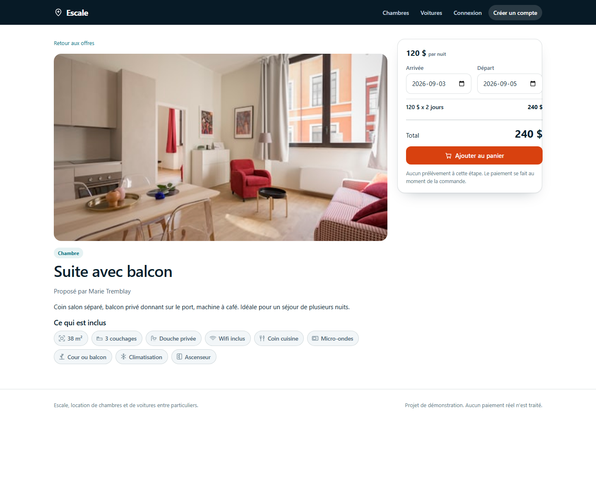
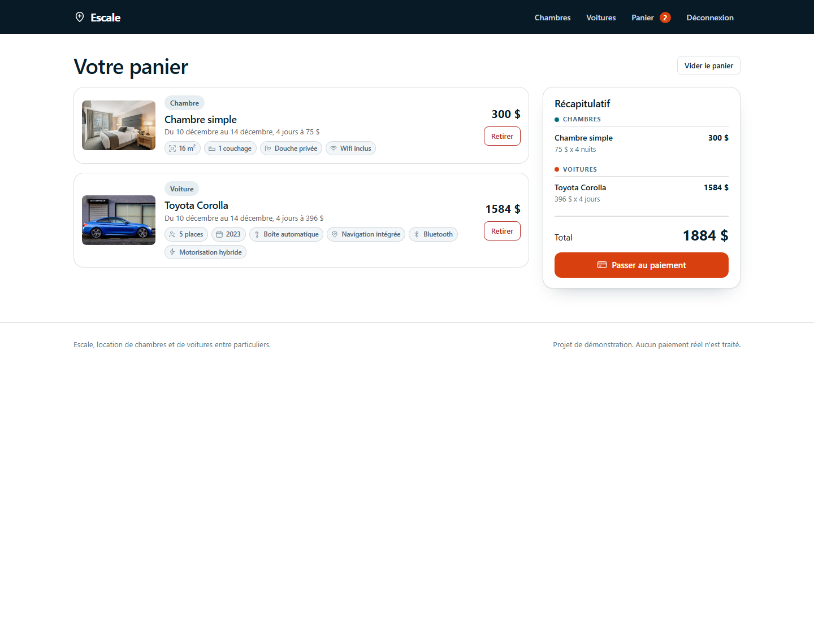
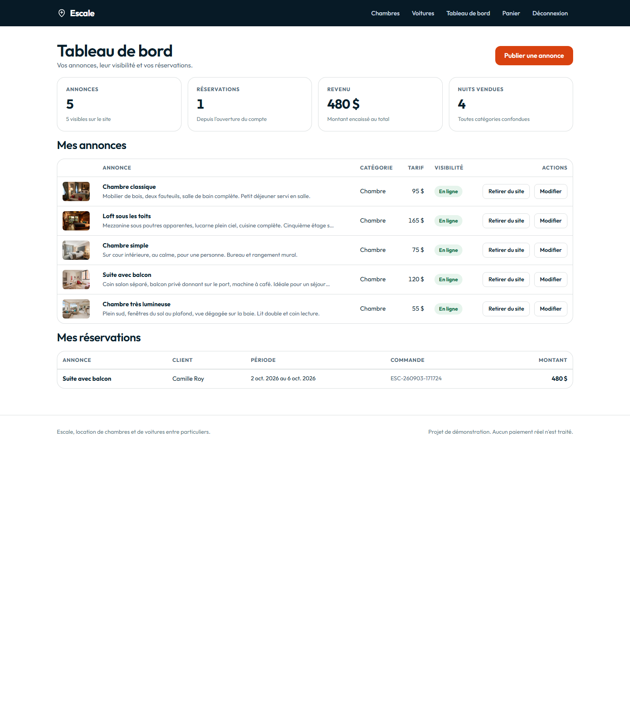

# Escale

A rental marketplace where rooms and cars are booked side by side. Owners
publish their own listings and control what the public sees; travellers search
by date, fill a cart and pay through a simulated gateway.

ASP.NET Core 8 Razor Pages, Entity Framework Core and SQLite.


## What it does

**Three kinds of account.** Anyone can register as a traveller for free, or as
an owner for a monthly subscription. An administrator sits above both. The role
decides what the account can reach: the cart and the checkout need any account,
the dashboard needs an owner, the administration section needs an administrator.

**An administrator sees the whole platform.** Every listing from every owner,
every account, every booking. They can edit or delete any listing, take one off
the site the moment it breaks the rules, and block an account from a start date
to an end date or until further notice.

**Owner dashboard.** Each owner sees only their own listings and only the
bookings placed on them. A listing can be taken off the public site with one
click and put back the same way, without deleting anything.

**A listing is a fleet, not a single unit.** An owner says how many identical
units they rent under one listing: one loft, six identical rooms, four of the
same car. Search subtracts the bookings that overlap the requested dates and
shows what is left, "3 véhicules disponibles", "Dernier véhicule disponible",
or "Complet sur ces dates" when every unit is taken. A full listing stays on
the site, greyed and labelled, with its booking button disabled; change the
dates and the count is recomputed on the spot. Nothing is stored: the remaining
count is derived from the fleet size minus the overlapping order lines, every
time.

**Two conditions gate a listing.** It appears publicly when its owner marked it
visible and the owner's account is in good standing. Block an account or let its
subscription lapse and its listings leave the site at once; nothing is deleted,
and they come back when the block ends or the subscription is renewed.

**Favourites live in a distributed cache.** A signed-in traveller can set a
listing aside and find it again under Favourites. The list is held in the cache
for five days from the last change, never in the database. Anyone not signed in
who clicks the heart lands on the sign-in page, which says why.

**Owners bring their own photographs.** An upload is checked on its file
signature rather than its extension, capped at 4 MB, and renamed before it is
stored. The photographs shipped with the site stay available to everyone.

**A cart that persists.** Cart lines live in the database, not in the session,
so they survive a sign-out. The summary keeps rooms and cars in separate groups
with their own subtotals.

**A simulated payment.** The card is validated the way a real gateway would:
length, Luhn checksum, expiry date and security code. The result is an
acceptance or a refusal, and no money moves. Card `4242 4242 4242 4242` is
accepted, `4000 0000 0000 0002` is refused by the issuer. Only the last four
digits are stored.

**Amenities as pictograms.** Each listing carries what is included, drawn as
small icons: shower, wifi, kitchen, microwave, dryer, yard, air conditioning,
lift for rooms; automatic gearbox, navigation, heated seats, bluetooth, hybrid,
four-wheel drive, large boot for cars. Size, sleeping places, seats and model
year are shown the same way.

| Listing details | Cart | Owner dashboard |
| --- | --- | --- |
|  |  |  |

## Running it

No password is stored in the repository. The demo accounts and the
administrator are created from user secrets, which is where the framework
expects development credentials to live. Pick your own value and set it twice:

```bash
cd src/Escale.Web
dotnet user-secrets set "Semences:MotDePasse" "Your.Password1"
dotnet user-secrets set "Administrateur:MotDePasse" "Your.Password1"
dotnet run
```

Startup stops with a clear message if the first one is missing, rather than
seeding accounts nobody can sign into. The database file is created on first
start and filled with fifteen amenities, eleven listings and three accounts.
Delete `escale.db` to start over.

| Account | Role |
| --- | --- |
| marie@escale.test | Owner, five rooms |
| hugo@escale.test | Owner, six cars |
| camille@escale.test | Traveller |
| admin@escale.test | Administrator |

They all use the password you set above.

## Structure

```
Escale
├── src/Escale.Web
│   ├── Entites        Annonce, Equipement, LignePanier, Commande, Utilisateur, Panier
│   ├── Interfaces     One interface per repository and per service, nothing else
│   ├── Repositories   The DbContext and the four repositories that query it
│   ├── Services       Availability, cart, orders, payment, favourites, photos, current user
│   ├── Pages          Public site, account, cart, checkout, dashboard
│   └── wwwroot        Stylesheet and photographs
└── tests/Escale.Tests
    ├── Services       Four service test classes
    └── Pages          Three page model test classes
```

Four layers, one direction. A page depends on service interfaces, a service
depends on repository interfaces, and a repository is the only thing that holds
a `ContexteEscale`. Nothing above the repository layer references Entity
Framework at all, so no page knows which database is behind it; swapping SQLite
for anything else touches five files in `Repositories/` and nothing more.

`Interfaces/` holds interfaces only. The small records a service returns
(`ResultatAjout`, `ResultatCommande`, `ResultatPaiement`, `DonneesCarte`) live
with the entities, so a refusal travels back as a value rather than an
exception.

Business rules sit in the services and nowhere else. `AnnonceService` answers
what may be offered and who may change it, `PanierService` guards what enters
the cart, `CommandeService` turns a cart into an order, and
`PaiementSimuleService` decides whether a card is acceptable. Order lines copy
the title, category and price at the moment of purchase, so a later change to a
listing never rewrites a past order.

## Layout

One stylesheet, no build step, no CSS framework. Colours, radii and spacing are
custom properties declared on `:root` and redefined for the dark theme, so a
change to the palette is a change to six lines.

Card and tile grids use `repeat(auto-fill, minmax(255px, 1fr))`, so the column
count follows the space available rather than a list of breakpoints: one column
on a phone, two to three on a tablet, four on a laptop, five on a wide monitor.
The container itself is a token, widened to 1360px past 1600px and 1560px past
1920px, so a large screen gets more content instead of more margin.

Four media queries handle only what width alone cannot decide: the booking panel
moves below the listing under 1000px, the search row stacks under 820px, forms
collapse to one column under 600px, and the header stops being sticky on a phone
where six wrapped links would eat a quarter of the screen.

## Rules

A listing leaves the public site when its owner is blocked or their
subscription lapses. Neither condition is written into the account entity, and
neither is written into the service that applies them. Each is a class:

```csharp
public interface IRegleDeDiffusion
{
    bool Autorise(Utilisateur compte, DateTime date);
    EtatCompte Etat(Utilisateur compte);
}
```

`DiffusionService` receives the rules as `IEnumerable<IRegleDeDiffusion>` and
asks all of them. Adding a third reason to pull a listing, an unverified
identity, a payment dispute, a regional restriction, means writing one class
and registering it. No existing rule changes, and neither does the service.
Registration order decides which reason is reported when several fail.

`Utilisateur` carries data and nothing else. The two states it can be in live
in their own types, `Abonnement` and `Blocage`, each owning its own validity
rule and mapped as an owned type so the accounts table stays one row per
account. The wording shown to a person, "Bloqué jusqu'au 31 décembre", is built
by a view partial from an `EtatCompte` value, never by the entity.

## Accounts

The account pages are the ASP.NET Core Identity UI, scaffolded into
`Areas/Identity/Pages/Account`. The security engine, password hashing, cookie,
lockout, authenticator and reset tokens, is Microsoft's, maintained and patched
through the NuGet package.

Signing up does not gate the account behind an email. Nobody registers in order
to wait for a message before they can look at listings, and asking someone to
confirm before they have seen anything is a step without a reason. The
confirmation machinery stays in place, tokens and pages included, so flipping
`SignIn.RequireConfirmedAccount` is the only change needed if that rule ever has
to hold. The login page carries the two links that mean something today:
forgotten password, and create an account.

What is native here is the code, not the markup. Every page model comes from the
scaffolder and keeps its handlers, its validation and its token calls. The views
are the project's own, built from the same design vocabulary as the rest of the
site, so a visitor never crosses a seam between the catalogue and the account
pages. Bootstrap is not loaded anywhere.

The account management area is the exception, and deliberately so: it keeps the
generated markup, dressed by `wwwroot/css/identite.css`, which implements the
class names it uses with the site's design tokens. The layout loads that sheet
only under `/Account/Manage`. Those pages are deep in the application, they
change with every SDK, and keeping them comparable to the template is worth more
there than a bespoke design.

The full page set is scaffolded, including the eight two-factor pages: the
authenticator setup, the code prompt at sign-in, recovery codes, and the reset
and disable paths. `Manage` is reachable from the header, and its side menu no
longer points at pages that do not exist.

The hardening is carried into the page models rather than the markup: lockout
after five failed attempts, the rate-limiting policy on every page that accepts
a secret, including the six-digit authenticator code and the recovery code, the
blocked account check at sign-in, the role choice with a subscription for
owners, and the security logging. Password reset and confirmation send their
link through the same `ICourrielService`, bridged to Identity's `IEmailSender`.
The penetration test was re-run against the new pages, CSRF, lockout and rate
limiting all hold.

## Security

Everything here follows what Microsoft documents for ASP.NET Core, with no
third-party package.

**Nothing sensitive lives in the source.** The administrator account is created
from configuration, `Administrateur:Courriel` and `Administrateur:MotDePasse`,
read from user secrets locally and from app settings or Key Vault in
production. With no configuration, no account is created. The demonstration
accounts and their password sit in `appsettings.Development.json` and the seed
routine only runs when the environment is Development.

**The schema is applied by migration, never at startup in production.**
Development runs `MigrateAsync`. Production checks for pending migrations, logs
an error and stops the bootstrap rather than mutating a live database. The
script for the operator is in `deploiement/schema.sql`. Microsoft's idempotent
form is not available on SQLite, so it is a plain script here; switching to SQL
Server or PostgreSQL gives `--idempotent` back.

**Sign-in is throttled twice.** Identity lockout stops the account after five
failed attempts for fifteen minutes, and the rate limiting middleware caps
sign-in, registration and checkout at eight requests per minute per caller, on
top of a global 120 per minute. Both limits are partitioned by identity when
signed in and by address otherwise.

**A content security policy that forbids inline script.** That constraint is why
`reservation.js`, `annonce.js` and `site.js` live in `wwwroot/js` and why no
element carries an `onerror` attribute. Alongside it: `X-Content-Type-Options`,
`X-Frame-Options`, `Referrer-Policy` and `Permissions-Policy`. The
authentication cookie is `HttpOnly`, `SameSite=Strict` and HTTPS only.

**The last unit cannot be sold twice.** Placing an order re-checks every line
inside a database transaction and rolls back if another customer took the last
unit between the check and the write.

## Penetration test

The app was attacked from its own URL across the OWASP Top 10, white, grey and
black box. Every category held:

- **Injection (A03).** SQL payloads in every parameter, `' OR '1'='1`,
  `; DROP TABLE Annonces`, `UNION SELECT`, left the database untouched: Entity
  Framework parameterises every query. Stored and reflected XSS came back
  HTML-encoded by Razor, angle brackets and all.
- **Broken access control (A01).** Anonymous callers are sent to sign-in, a
  traveller to the access-denied page. One owner cannot open, edit, toggle or
  delete another owner's listing (404 or no-op), nor read another customer's
  receipt (404, no card digits leaked). Forcing `Role=Administrateur` at
  registration yields a traveller; forging `LoueurId` on a new listing is
  overwritten with the caller's own id.
- **CSRF.** Every state change without an antiforgery token is refused with 400.
- **Open redirect.** A `retour` or `ReturnUrl` pointing off-site lands back on
  the local home page.
- **Path traversal.** `../appsettings.json`, encoded variants and the database
  file all return 404; no configuration or secret is served.
- **Auth (A07).** Identical message whether an account exists or not; lockout
  after five failed attempts; the auth cookie is Secure, HttpOnly and
  SameSite=Strict.

Two findings were fixed: the `Server: Kestrel` header is removed
(`AddServerHeader = false`), and the antiforgery cookie is named and hardened
with HttpOnly and SameSite=Strict.

## Logging

`ILogger<T>` throughout, with message templates and never string
concatenation: that is what makes the log queryable and what closes log
injection, since user input is passed as a parameter rather than spliced into
the message. Production writes JSON to the console, which App Service,
Application Insights and any collector can read.

Each security event has a stable id in `Infrastructure/JournalDeSecurite`.
OWASP A09 asks for authentication failures, access control failures and
server-side validation failures; the suite covers sign-in success and refusal,
locked accounts, account creation, every administrator action, orders,
refused payments and rejected uploads.

What never reaches the log: card numbers, expiry dates and security codes,
passwords including failed attempts, session cookies and tokens, connection
strings, and email addresses. Accounts are identified by their technical id,
which keeps personal data out of the log under Quebec's Law 25.

## Performance

Read-only queries use `AsNoTracking`, so Entity Framework builds no change
tracking snapshot for listings, orders and account lists. The modification path
keeps tracking, which is why `AnnonceRepository` separates `Suivies` from
`Completes`. Static files are served with a one-year immutable cache header,
which costs nothing because `asp-append-version` already fingerprints them. The
in-memory cache carries an explicit size limit so it cannot grow for the life of
the process.

## Caching

Favourites go through `IDistributedCache`, the single interface Microsoft's
guidance puts in front of every cache provider. The provider is chosen at
startup from configuration:

```csharp
string? redis = builder.Configuration.GetConnectionString("Redis");

if (string.IsNullOrWhiteSpace(redis))
{
    builder.Services.AddDistributedMemoryCache();
}
else
{
    builder.Services.AddStackExchangeRedisCache(options =>
    {
        options.Configuration = redis;
        options.InstanceName = "Escale:";
    });
}
```

With no connection string the app uses `AddDistributedMemoryCache`, the
framework implementation Microsoft documents for development. Add a
`ConnectionStrings:Redis` value, in user secrets locally or in app settings on
Azure, and the same code runs against Azure Cache for Redis, which Microsoft
recommends for production. Nothing above `FavorisService` changes.

Each user gets one entry, `escale:favoris:{id}`, holding the ordered list of
listing ids as JSON. It is written with
`AbsoluteExpirationRelativeToNow = TimeSpan.FromDays(5)`, so the five days run
from the last change and the entry then expires on its own. Favourites are
deliberately not persisted: losing them after five days is the intended
behaviour, not a defect.

## Tests

```bash
dotnet test
```

38 tests, no database, no host, no HTTP: every one runs against mocked
interfaces and the suite finishes in about 140 ms.

The suite tests page models and nothing else, which is what Microsoft's own
guidance for Razor Pages covers. Each class is named after the page model it
exercises and asserts the two things a handler is responsible for: the
`IActionResult` it returns, and the state it leaves on the page.

| Test class | Page model | Tests |
| --- | --- | --- |
| `IndexModelTests` | public search | 5 |
| `DetailsModelTests` | listing details | 8 |
| `PanierIndexModelTests` | cart | 3 |
| `PaiementModelTests` | checkout | 7 |
| `ConfirmationModelTests` | receipt | 3 |
| `TableauIndexModelTests` | owner dashboard | 5 |
| `TableauAnnonceModelTests` | publish and edit | 7 |

Page models get the signed-in user through `IUtilisateurCourant` rather than
`UserManager`, which is what makes them testable at all: a test supplies an id
in one line instead of building an Identity stack. The account pages keep
`UserManager` and `SignInManager`, because creating and signing in a user is
genuinely their job, and they are covered by running the app rather than by
unit tests.

## Notes

The photographs shipped with the site are royalty free. The payment gateway is
simulated: card details are validated and then discarded, no charge is made, and
only the last four digits reach the database.

## Licence

MIT
